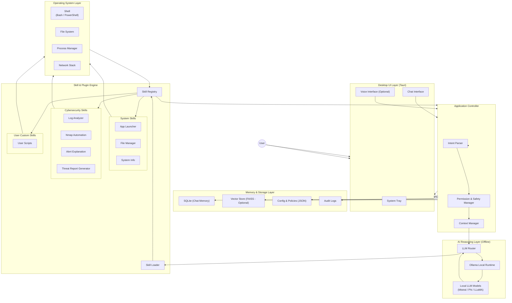

```mermaid
flowchart TB

%% =========================
%% USER INTERACTION LAYER
%% =========================
User((User))

User --> UI

subgraph UI["Desktop UI Layer (Tauri)"]
    ChatUI["Chat Interface"]
    VoiceUI["Voice Interface (Optional)"]
    TrayUI["System Tray"]
end

%% =========================
%% FRONTEND COMMUNICATION
%% =========================
UI -->|IPC| Controller

%% =========================
%% CORE CONTROLLER
%% =========================
subgraph Controller["Application Controller"]
    IntentParser["Intent Parser"]
    PermissionManager["Permission & Safety Manager"]
    ContextManager["Context Manager"]
end

%% =========================
%% AI / LLM LAYER
%% =========================
subgraph AI["AI Reasoning Layer (Offline)"]
    LLMRouter["LLM Router"]
    Ollama["Ollama Local Runtime"]
    LLMModel["Local LLM Models\n(Mistral / Phi / LLaMA)"]
end

%% =========================
%% MEMORY LAYER
%% =========================
subgraph Memory["Memory & Storage Layer"]
    SQLite["SQLite (Chat Memory)"]
    VectorDB["Vector Store (FAISS - Optional)"]
    Config["Config & Policies (JSON)"]
    AuditLogs["Audit Logs"]
end

%% =========================
%% SKILL / PLUGIN SYSTEM
%% =========================
subgraph Skills["Skill & Plugin Engine"]
    SkillLoader["Skill Loader"]
    SkillRegistry["Skill Registry"]
    
    subgraph SystemSkills["System Skills"]
        AppLauncher["App Launcher"]
        FileManager["File Manager"]
        SysInfo["System Info"]
    end

    subgraph CyberSkills["Cybersecurity Skills"]
        LogAnalyzer["Log Analyzer"]
        NmapRunner["Nmap Automation"]
        AlertExplainer["Alert Explanation"]
        ReportGenerator["Threat Report Generator"]
    end

    subgraph UserSkills["User Custom Skills"]
        CustomScripts["User Scripts"]
    end
end

%% =========================
%% OS & TOOLING LAYER
%% =========================
subgraph OS["Operating System Layer"]
    Shell["Shell\n(Bash / PowerShell)"]
    FileSystem["File System"]
    ProcessMgr["Process Manager"]
    Network["Network Stack"]
end

%% =========================
%% FLOW CONNECTIONS
%% =========================
User --> UI

ChatUI --> Controller
VoiceUI --> Controller

Controller --> IntentParser
IntentParser --> PermissionManager
PermissionManager --> ContextManager

ContextManager --> LLMRouter
LLMRouter --> Ollama
Ollama --> LLMModel
LLMModel --> LLMRouter

LLMRouter --> SkillLoader
SkillLoader --> SkillRegistry

SkillRegistry --> SystemSkills
SkillRegistry --> CyberSkills
SkillRegistry --> UserSkills

SystemSkills --> OS
CyberSkills --> OS
UserSkills --> OS

OS --> SkillRegistry
SkillRegistry --> Controller

Controller --> SQLite
Controller --> VectorDB
Controller --> Config
Controller --> AuditLogs

Controller --> UI

```
