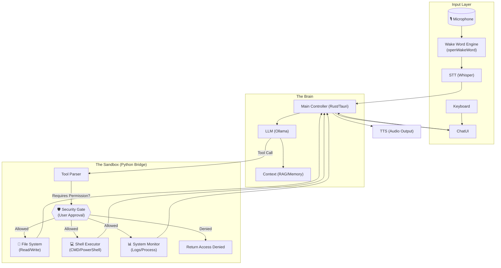

```mermaid
flowchart TB

    %% =========================
    %% INPUT LAYER
    %% =========================
    subgraph Input ["Input Layer"]
        Mic[("🎙️ Microphone")] --> WakeWord["Wake Word Engine\n(openWakeWord)"]
        WakeWord --> STT["STT (Whisper)"]
        Keyboard --> ChatUI
    end

    %% =========================
    %% CORE LOGIC
    %% =========================
    STT --> Controller["Main Controller (Rust/Tauri)"]
    ChatUI --> Controller

    subgraph Intelligence ["The Brain"]
        Controller --> LLM["LLM (Ollama)"]
        LLM --> Context["Context (RAG/Memory)"]
    end

    %% =========================
    %% EXECUTION LAYER (THE HANDS)
    %% =========================
    subgraph Execution ["The Sandbox (Python Bridge)"]
        LLM -->|Tool Call| ToolParser["Tool Parser"]
        
        ToolParser -->|Requires Permission?| SecurityGate{{"🛡️ Security Gate\n(User Approval)"}}
        
        SecurityGate -- "Allowed" --> FileIO["📂 File System\n(Read/Write)"]
        SecurityGate -- "Allowed" --> Shell["💻 Shell Executor\n(CMD/PowerShell)"]
        SecurityGate -- "Allowed" --> SysInfo["📊 System Monitor\n(Logs/Process)"]
        
        SecurityGate -- "Denied" --> Error["Return Access Denied"]
    end

    %% =========================
    %% OUTPUT LAYER
    %% =========================
    FileIO --> Controller
    Shell --> Controller
    SysInfo --> Controller
    
    Controller --> TTS["TTS (Audio Output)"]
    Controller --> ChatUI
```
